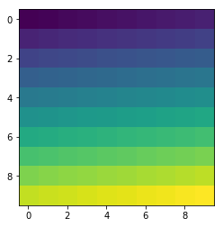
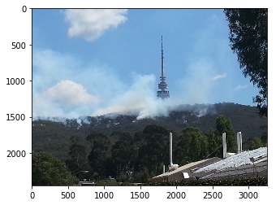
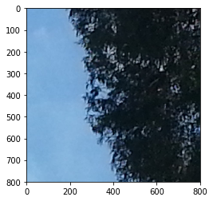
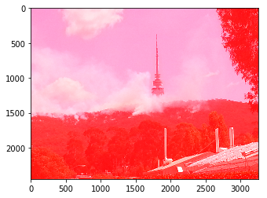

## This tutorial introduces numpy, a Python library for performing numerical computations in Python

#### In order to be able to use numpy we need to import the library using the special word `import`. Also, to avoid typing `numpy` every time we want to use one if its functions we can provide an alias using the special word `as`:


```python
import numpy as np
```

#### Now, we have access to all the functions available in `numpy` by typing `np.name_of_function`. For example, the equivalent of `1 + 1` in Python can be done in `numpy`:


```python
np.add(1,1)
```


    2


##### Although this might not seem very useful, even simple operations like this one can be much quicker in `numpy` than in standard Python when using lots of numbers.

#### To access the documentation explaining how a function is used, its input parameters and output format we can press `Shift+Tab` after the function name"


```python
np.add
```


    <ufunc 'add'>


#### By default the result of a function or operation is shown underneath the cell containing the code. If we want to reuse this result for a later operation we can assign it to a variable:


```python
a = np.add(2,3)
```

#### The contents of this variable can be displayed at any moment by typing the variable name in a new cell:


```python
a
```


    5


#### One of the most powerful concepts in numpy are `arrays` which are equivalent to lists of numbers. To declare a numpy array we can do:


```python
np.array([1,2,3,4,5,6,7,8,9])
```


    array([1, 2, 3, 4, 5, 6, 7, 8, 9])


#### Most of the functions and operations defined in numpy can be applied to arrays. For example, with the previous operation:


```python
arr1 = np.array([1,2,3,4])
arr2 = np.array([3,4,5,6])

np.add(arr1, arr2)
```


    array([ 4,  6,  8, 10])


##### Try adding another number to one of the arrays and see what happens. Normally, the arrays need to have the same dimensions....

#### Arrays can be sliced and diced. We can get subsets of the arrays using the indexing notation which is `[start:end:stride]`. Let's see what this means:


```python
arr = np.array([0,1,2,3,4,5,6,7,8,9,10,11,12,13,14,15])

print(arr[5])
print(arr[5:])
print(arr[:5])
print(arr[::2])
```

    5
    [ 5  6  7  8  9 10 11 12 13 14 15]
    [0 1 2 3 4]
    [ 0  2  4  6  8 10 12 14]


##### Experiment playing with the indexes to understand the meaning of start, end and stride. What happend if you don't specify a start? What value uses numpy instead? Note that numpy indexes start on `0`, the same convention used in Python lists.

#### Numpy arrays can have multiple dimensions. For example, to define a `column` array: 


```python
np.array([[1,2,3,4,5,6,7,8,9]])
```


    array([[1, 2, 3, 4, 5, 6, 7, 8, 9]])


#### To visualise the shape or dimensions of a numpy array we can add the suffix `.shape`


```python
print(np.array([1,2,3,4,5,6,7,8,9]).shape)
print(np.array([[1,2,3,4,5,6,7,8,9]]).shape)
```

    (9,)
    (1, 9)


##### A column array is a two dimensional array with just one column. To define a two dimensional array we can do:


```python
np.array([[1,2,3,4],[5,6,7,8]])
```


    array([[1, 2, 3, 4],
           [5, 6, 7, 8]])


#### Any array can be reshaped into different shapes using the function `reshape`:


```python
np.array([1,2,3,4,5,6,7,8]).reshape((2,4))
```


    array([[1, 2, 3, 4],
           [5, 6, 7, 8]])


#### Can you try defining a 3-dimensional array of shape (5,3)?

#### Create another one and use the numpy function to add both arrays:

## This tutorial introduces matplotlib, a Python library for plotting and how to use numpy to visualise images.

#### For the purposes of this tutorial we are going to use a part of matplotlib called pyplot. We import it by doing:


```python
%matplotlib inline

import numpy as np
from matplotlib import pyplot as plt
```

#### An image can be seen as a 2-dimensional array. To visualise the contents of a numpy array:


```python
plt.imshow(np.arange(100).reshape(10,10))
```


    <matplotlib.image.AxesImage at 0x113089f28>





##### Can you figure out what the `arange` function does? Can you create a similar image with (200,200) dimensions?

#### We can use the Pyplot library to load an image using the function `imread`


```python
im = plt.imread('data/BM_Fire.jpg')
```

##### Let's display this image using the `imshow` function. What are the dimensions of the `im` array? 


```python
plt.imshow(im)
```


    <matplotlib.image.AxesImage at 0x11323f208>





##### This is a photo of Black Mountain taken during prescribed burns in 2014. A colour image is normally composed of three layers containing the values of the red, green and blue pixels. When we display an image we see all three colours combined.

#### Let's use the indexing functionality of numpy to select portions of this image. For example to select the top right corner:


```python
plt.imshow(im[:800,-800:,:])
```


    <matplotlib.image.AxesImage at 0x1132e58d0>





#### Let's practice your indexing skills! Can you create a cropped image around Black Mountain's tower? Hint: first dimension is the vertical coordinates, second dimension is the horizontal coordinates and the third are the RGB channels of the image.

#### Let's play around with this a little bit. For example, let's replace all the values in the 'red' layer with the value 255, this is the highest red value possible and it will make your whole image redish. The following command will replace all the values in the red channel (axis 3) with the value 255, and see what happens


```python
#Don't worry about this for the moment:
im.setflags(write=1)

im[:,:,0] = 255
plt.imshow(im)
```


    <matplotlib.image.AxesImage at 0x1133da320>




***

[back](/program.html)
