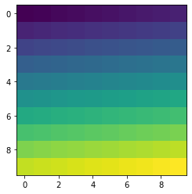
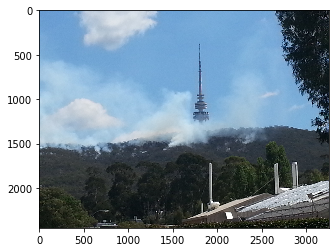
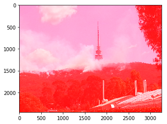

## This tutorial introduces numpy, a Python library for performing numerical computations in Python

#### In order to be able to use numpy we need to import the library using the special word `import`. Also, to avoid typing `numpy` every time we want to use one if its functions we can provide an alias using the special word `as`:


```python
import numpy as np
```

#### Now, we have access to all the functions available in `numpy` by typing `np.name_of_function`. For example, the equivalent of `1 + 1` in Python can be done in `numpy`:


```python
np.add(1,1)
```


    2


##### Although this might not seem very useful, however, even simple operations like this one, can be much quicker in `numpy` than in standard Python when using lots of numbers.

#### To access the documentation explaining how a function is used, its input parameters and output format we can press `Shift+Tab` after the function name"


```python
np.add
```


    <ufunc 'add'>


#### By default the result of a function or operation is shown underneath the cell containing the code. If we want to reuse this result for a later operation we can assign it to a variable:


```python
a = np.add(2,3)
```

#### The contents of this variable can be displayed at any moment by typing the variable name in a new cell:


```python
a
```


    5


#### The core concept in numpy is the `array` which is equivalent to lists of numbers but can be multidimensional. To declare a numpy array we do:


```python
np.array([1,2,3,4,5,6,7,8,9])
```


    array([1, 2, 3, 4, 5, 6, 7, 8, 9])


#### Most of the functions and operations defined in numpy can be applied to arrays. For example, with the previous operation:


```python
arr1 = np.array([1,2,3,4])
arr2 = np.array([3,4,5,6])

np.add(arr1, arr2)
```


    array([ 4,  6,  8, 10])


#### But a more simple and convenient notation can also be used:


```python
arr1 + arr2
```


    array([ 4,  6,  8, 10])


#### Arrays can be sliced and diced. We can get subsets of the arrays using the indexing notation which is `[start:end:stride]`. Let's see what this means:


```python
arr = np.array([0,1,2,3,4,5,6,7,8,9,10,11,12,13,14,15])

print(arr[5])
print(arr[5:])
print(arr[:5])
print(arr[::2])
```

    5
    [ 5  6  7  8  9 10 11 12 13 14 15]
    [0 1 2 3 4]
    [ 0  2  4  6  8 10 12 14]


##### Experiment playing with the indexes to understand the meaning of start, end and stride. What happend if you don't specify a start? What value numpy uses instead? Note that numpy indexes start on `0`, the same convention used in Python lists.

#### Indexes can also be negative, meaning that you start counting by the end. For example, to select the last 2 elements in an array we can do:


```python
arr[-2:]
```


    array([14, 15])


#### Can you figure out how an easy way of selecting all the elements in the previous array excluding the last one, [15]?


```python

```

#### What about doing the same but now every 3rd element? 
Hint: Result should be ?`[0,3,6,9,12]`


```python

```

#### Numpy arrays can have multiple dimensions. For example, we define a 2-dimensional `(1,9)` array using nested square bracket: 


```python
np.array([[1,2,3,4,5,6,7,8,9]])
```


    array([[1, 2, 3, 4, 5, 6, 7, 8, 9]])


#### To visualise the shape or dimensions of a numpy array we can add the suffix `.shape`


```python
print(np.array([1,2,3,4,5,6,7,8,9]).shape)
print(np.array([[1,2,3,4,5,6,7,8,9]]).shape)
print(np.array([[1],[2],[3],[4],[5],[6],[7],[8],[9]]).shape)
```

    (9,)
    (1, 9)
    (9, 1)


#### Any array can be reshaped into different shapes using the function `reshape`:


```python
np.array([1,2,3,4,5,6,7,8]).reshape((2,4))
```

#### If you are concerned about having to type so many squared brackets, there are more simple and convenient ways of doing the same:


```python
print(np.array([1,2,3,4,5,6,7,8,9]).reshape(1,9).shape)
print(np.array([1,2,3,4,5,6,7,8,9]).reshape(9,1).shape)
print(np.array([1,2,3,4,5,6,7,8,9]).reshape(3,3).shape)
```

    (1, 9)
    (9, 1)
    (3, 3)


#### Also there are shortcuts for declaring common arrays without having to type all their elements:


```python
print(np.arange(9))
print(np.ones((3,3)))
print(np.zeros((2,2,2)))
```

    [0 1 2 3 4 5 6 7 8]
    [[1. 1. 1.]
     [1. 1. 1.]
     [1. 1. 1.]]
    [[[0. 0.]
      [0. 0.]]
    
     [[0. 0.]
      [0. 0.]]]


#### Can you try to declare a 3-dimensional array of shape (5,3,3)? Assign it to a variable


```python

```

#### Create another one with the same shape and use the numpy function to add both arrays:


```python

```

### Some useful functions in Numpy

#### Calculate the mean and standard deviation of an array


```python
arr = np.arange(9).reshape((3,3))

print(arr)

print(np.mean(arr))
print(np.std(arr))

print(np.mean(arr, axis=0))
print(np.mean(arr, axis=1))

print(np.sum(arr))

arr*2
arr*(np.ones((3,3))*2)
```

    [[0 1 2]
     [3 4 5]
     [6 7 8]]
    4.0
    2.581988897471611
    [3. 4. 5.]
    [1. 4. 7.]
    36


    array([[ 0.,  2.,  4.],
           [ 6.,  8., 10.],
           [12., 14., 16.]])


### Numpy data types

#### Numpy arrays can contain numerical values of different types. These types can be divided in these groups:

 * Integers
    * Signed
        * 8 bits: `uint8`
        * 16 bits: `uint16`
        * 32 bits: `uint32`
        * 64 bits: `uint64`
    * Unsigned
        * 8 bits: `int8`
        * 16 bits: `int16`
        * 32 bits: `int32`
        * 64 bits: `int64`

* Floats
    * 32 bits: `float32`
    * 64 bits: `float64`
    
#### We can specify the type of an array when we declare it or change the type of an existing one with the following expressions:


```python
arr = np.ones((10,10,10), dtype=np.uint8)

arr[4,4,4] = -1
print(arr[4,4,4])

arr = arr.astype(np.int8)
print(arr[4,4,4])

arr = arr.astype(np.float32)
print(arr[4,4,4])
```

    255
    -1
    -1.0


#### There is a binary type in numpy called boolean which encodes `True` and `False` values. For example:


```python
arr = (arr > 0)

print(arr[:,:,4])

arr.dtype
```

    [[ True  True  True  True  True  True  True  True  True  True]
     [ True  True  True  True  True  True  True  True  True  True]
     [ True  True  True  True  True  True  True  True  True  True]
     [ True  True  True  True  True  True  True  True  True  True]
     [ True  True  True  True False  True  True  True  True  True]
     [ True  True  True  True  True  True  True  True  True  True]
     [ True  True  True  True  True  True  True  True  True  True]
     [ True  True  True  True  True  True  True  True  True  True]
     [ True  True  True  True  True  True  True  True  True  True]
     [ True  True  True  True  True  True  True  True  True  True]]


    dtype('bool')


#### Boolean types are quite handy for indexing and selecting parts of images as we will see later. Many numpy functions also work with Boolean types.


```python
print(np.count_nonzero(arr[:,:,4]))

a = np.array([1,1,0,0], dtype=np.bool)
b = np.array([1,0,0,1], dtype=np.bool)
np.logical_and(a, b)
```

    99


    array([ True, False, False, False])


## This second part introduces matplotlib, a Python library for plotting numpy arrays as images.

#### For the purposes of this tutorial we are going to use a part of matplotlib called pyplot. We import it by doing:


```python
%matplotlib inline

import numpy as np
from matplotlib import pyplot as plt
```

#### An image can be seen as a 2-dimensional array. To visualise the contents of a numpy array:


```python
plt.imshow(np.arange(100).reshape(10,10))
```


    <matplotlib.image.AxesImage at 0x7f86ec53b550>





Can you create a similar image with an array with shape (50,50)?

#### We can use the Pyplot library to load an image using the function `imread`


```python
im = plt.imread('data/black_mountain_fire.jpg')
```

#### This image is a 3-dimensional numpy array. By convention the first dimension corresponds to the vertical axis, the second to the horizontal axis and the third are the Red, Green and Blue channels of the image.


```python
im.shape
```


    (2448, 3264, 3)


##### Let's display this image using the `imshow` function. What are the dimensions of the `im` array? 


```python
plt.imshow(im)
```


    <matplotlib.image.AxesImage at 0x7f869c2abe80>





##### This is a photo of Black Mountain taken during prescribed burns in 2014. A colour image is normally composed of three layers containing the values of the red, green and blue pixels. When we display an image we see all three colours combined.

#### Knowing the extents of the image given by its shape, can you display the values of one of the pixels in the sky? You need to provide one index for each x and y dimensions and get all three channels. Make sure the values represent a mostly blue pixel.


```python

```

#### Let's use the indexing functionality of numpy to select a slice of this image. For example to select the top right corner:


```python
plt.imshow(im[:800,-800:,:])
```


    <matplotlib.image.AxesImage at 0x1132e58d0>


#### Let's practice your indexing skills! Can you create a cropped image around Black Mountain's tower? Remember: first dimension is the vertical coordinates, second dimension is the horizontal coordinates and the third are the RGB channels of the image.


```python

```

#### Let's play around with this a little bit. For example, let's replace all the values in the 'red' layer with the value 255, this is the highest red value possible and it will make your whole image redish. The following command will replace all the values in the red channel (axis 3) with the value 255, and see what happens


```python
#Don't worry about this for the moment:
im.setflags(write=1)

im[:,:,0] = 255
plt.imshow(im)
```


    <matplotlib.image.AxesImage at 0x1133da320>





```python

```
