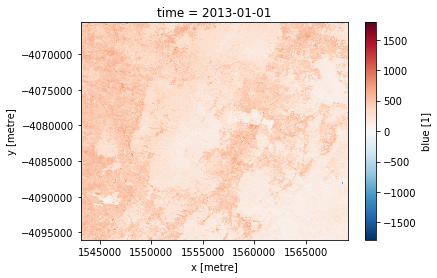
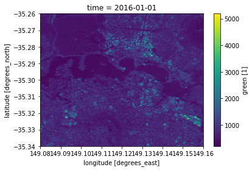
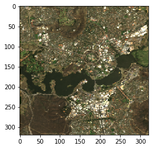

## This tutorial introduces XArray, a Python library for working with labeled multidimensional arrays.

#### DEA uses XArray as its data model. To better understand what it is, let first do a simple experiment using a combination of plain numpy arrays and Python dictionaries.

#### Suposse we have a satellite image with three bands: Red, NIR and SWIR. These bands are represented as 2-dimensional numpy arrays and the latitude and longitude coordinates for each dimension are represented using 1-dimensional arrays. Finally, we also have some metadata that comes with this image.


```python
import datacube

dc = datacube.Datacube(app='welcome-to-dea')

type(dc)
```


    datacube.api.core.Datacube


#### This `dc` object is the handle to all DEA's functionality. For example to list the products available:


```python
dc.list_products()
```


<div>
<style scoped>
    .dataframe tbody tr th:only-of-type {
        vertical-align: middle;
    }

    .dataframe tbody tr th {
        vertical-align: top;
    }

    .dataframe thead th {
        text-align: right;
    }
</style>
<table border="1" class="dataframe">
  <thead>
    <tr style="text-align: right;">
      <th></th>
      <th>name</th>
      <th>description</th>
      <th>gqa_mean_xy</th>
      <th>instrument</th>
      <th>gqa_abs_iterative_mean_x</th>
      <th>region_code</th>
      <th>platform</th>
      <th>product_type</th>
      <th>gqa_abs_iterative_mean_xy</th>
      <th>lat</th>
      <th>...</th>
      <th>gqa_cep90</th>
      <th>gqa_abs_y</th>
      <th>gqa_stddev_x</th>
      <th>time</th>
      <th>lon</th>
      <th>eo_gsd</th>
      <th>crs</th>
      <th>resolution</th>
      <th>tile_size</th>
      <th>spatial_dimensions</th>
    </tr>
    <tr>
      <th>id</th>
      <th></th>
      <th></th>
      <th></th>
      <th></th>
      <th></th>
      <th></th>
      <th></th>
      <th></th>
      <th></th>
      <th></th>
      <th></th>
      <th></th>
      <th></th>
      <th></th>
      <th></th>
      <th></th>
      <th></th>
      <th></th>
      <th></th>
      <th></th>
      <th></th>
    </tr>
  </thead>
  <tbody>
    <tr>
      <th>10</th>
      <td>fc_percentile_albers_annual</td>
      <td>Landsat Fractional Cover percentile 25 metre, ...</td>
      <td>NaN</td>
      <td>TM,ETM+,OLI</td>
      <td>NaN</td>
      <td>NaN</td>
      <td>LANDSAT_5,LANDSAT_7,LANDSAT_8</td>
      <td>fractional_cover_statistical_summary</td>
      <td>NaN</td>
      <td>None</td>
      <td>...</td>
      <td>NaN</td>
      <td>NaN</td>
      <td>NaN</td>
      <td>None</td>
      <td>None</td>
      <td>NaN</td>
      <td>EPSG:3577</td>
      <td>(-25, 25)</td>
      <td>(100000.0, 100000.0)</td>
      <td>(y, x)</td>
    </tr>
    <tr>
      <th>11</th>
      <td>fc_percentile_albers_seasonal</td>
      <td>Landsat Fractional Cover percentile 25 metre, ...</td>
      <td>NaN</td>
      <td>TM,ETM+,OLI</td>
      <td>NaN</td>
      <td>NaN</td>
      <td>LANDSAT_5,LANDSAT_7,LANDSAT_8</td>
      <td>fractional_cover_seasonal_summary</td>
      <td>NaN</td>
      <td>None</td>
      <td>...</td>
      <td>NaN</td>
      <td>NaN</td>
      <td>NaN</td>
      <td>None</td>
      <td>None</td>
      <td>NaN</td>
      <td>EPSG:3577</td>
      <td>(-25, 25)</td>
      <td>(100000.0, 100000.0)</td>
      <td>(y, x)</td>
    </tr>
    <tr>
      <th>33</th>
      <td>ga_ls5t_ard_3</td>
      <td>Landsat 5 ARD</td>
      <td>NaN</td>
      <td>None</td>
      <td>NaN</td>
      <td>NaN</td>
      <td>None</td>
      <td>NaN</td>
      <td>NaN</td>
      <td>None</td>
      <td>...</td>
      <td>NaN</td>
      <td>NaN</td>
      <td>NaN</td>
      <td>None</td>
      <td>None</td>
      <td>NaN</td>
      <td>NaN</td>
      <td>NaN</td>
      <td>NaN</td>
      <td>NaN</td>
    </tr>
    <tr>
      <th>34</th>
      <td>ga_ls7e_ard_3</td>
      <td>Landsat 7 ARD</td>
      <td>NaN</td>
      <td>None</td>
      <td>NaN</td>
      <td>NaN</td>
      <td>None</td>
      <td>NaN</td>
      <td>NaN</td>
      <td>None</td>
      <td>...</td>
      <td>NaN</td>
      <td>NaN</td>
      <td>NaN</td>
      <td>None</td>
      <td>None</td>
      <td>NaN</td>
      <td>NaN</td>
      <td>NaN</td>
      <td>NaN</td>
      <td>NaN</td>
    </tr>
    <tr>
      <th>35</th>
      <td>ga_ls8c_ard_3</td>
      <td>Landsat 8 ARD</td>
      <td>NaN</td>
      <td>None</td>
      <td>NaN</td>
      <td>NaN</td>
      <td>None</td>
      <td>NaN</td>
      <td>NaN</td>
      <td>None</td>
      <td>...</td>
      <td>NaN</td>
      <td>NaN</td>
      <td>NaN</td>
      <td>None</td>
      <td>None</td>
      <td>NaN</td>
      <td>NaN</td>
      <td>NaN</td>
      <td>NaN</td>
      <td>NaN</td>
    </tr>
    <tr>
      <th>46</th>
      <td>ga_s2a_ard_nbar_granule</td>
      <td>Sentinel-2A MSI Definitive ARD - NBAR and Pixe...</td>
      <td>NaN</td>
      <td>MSI</td>
      <td>NaN</td>
      <td>NaN</td>
      <td>SENTINEL_2A</td>
      <td>S2MSIARD_NBAR</td>
      <td>NaN</td>
      <td>None</td>
      <td>...</td>
      <td>NaN</td>
      <td>NaN</td>
      <td>NaN</td>
      <td>None</td>
      <td>None</td>
      <td>NaN</td>
      <td>NaN</td>
      <td>NaN</td>
      <td>NaN</td>
      <td>NaN</td>
    </tr>
    <tr>
      <th>47</th>
      <td>ga_s2b_ard_nbar_granule</td>
      <td>Sentinel-2B MSI Definitive ARD - NBAR and Pixe...</td>
      <td>NaN</td>
      <td>MSI</td>
      <td>NaN</td>
      <td>NaN</td>
      <td>SENTINEL_2B</td>
      <td>S2MSIARD_NBAR</td>
      <td>NaN</td>
      <td>None</td>
      <td>...</td>
      <td>NaN</td>
      <td>NaN</td>
      <td>NaN</td>
      <td>None</td>
      <td>None</td>
      <td>NaN</td>
      <td>NaN</td>
      <td>NaN</td>
      <td>NaN</td>
      <td>NaN</td>
    </tr>
    <tr>
      <th>6</th>
      <td>high_tide_comp_20p</td>
      <td>High tide 20 percentage composites 25m v. 2.0.0</td>
      <td>NaN</td>
      <td>None</td>
      <td>NaN</td>
      <td>NaN</td>
      <td>None</td>
      <td>tidal_composite</td>
      <td>NaN</td>
      <td>None</td>
      <td>...</td>
      <td>NaN</td>
      <td>NaN</td>
      <td>NaN</td>
      <td>None</td>
      <td>None</td>
      <td>NaN</td>
      <td>EPSG:3577</td>
      <td>(-25, 25)</td>
      <td>None</td>
      <td>(y, x)</td>
    </tr>
    <tr>
      <th>27</th>
      <td>item_v2</td>
      <td>Relative Extents Model</td>
      <td>NaN</td>
      <td>None</td>
      <td>NaN</td>
      <td>NaN</td>
      <td>None</td>
      <td>item_v2.0.0</td>
      <td>NaN</td>
      <td>None</td>
      <td>...</td>
      <td>NaN</td>
      <td>NaN</td>
      <td>NaN</td>
      <td>None</td>
      <td>None</td>
      <td>NaN</td>
      <td>EPSG:3577</td>
      <td>(-25, 25)</td>
      <td>None</td>
      <td>(y, x)</td>
    </tr>
    <tr>
      <th>28</th>
      <td>item_v2_conf</td>
      <td>Average ndwi Standard Deviation, the Confidenc...</td>
      <td>NaN</td>
      <td>None</td>
      <td>NaN</td>
      <td>NaN</td>
      <td>None</td>
      <td>item_v2.0.0</td>
      <td>NaN</td>
      <td>None</td>
      <td>...</td>
      <td>NaN</td>
      <td>NaN</td>
      <td>NaN</td>
      <td>None</td>
      <td>None</td>
      <td>NaN</td>
      <td>EPSG:3577</td>
      <td>(-25, 25)</td>
      <td>None</td>
      <td>(y, x)</td>
    </tr>
    <tr>
      <th>9</th>
      <td>landsat_barest_earth</td>
      <td>Landsat-5/Landsat-7/Landsat-8 combined Barest ...</td>
      <td>NaN</td>
      <td>TM,ETM+,OLI</td>
      <td>NaN</td>
      <td>NaN</td>
      <td>LANDSAT_5,LANDSAT_7,LANDSAT_8</td>
      <td>landsat_barest_earth</td>
      <td>NaN</td>
      <td>None</td>
      <td>...</td>
      <td>NaN</td>
      <td>NaN</td>
      <td>NaN</td>
      <td>None</td>
      <td>None</td>
      <td>NaN</td>
      <td>EPSG:3577</td>
      <td>(-25, 25)</td>
      <td>(100000.0, 100000.0)</td>
      <td>(y, x)</td>
    </tr>
    <tr>
      <th>7</th>
      <td>low_tide_comp_20p</td>
      <td>Low tide 20 percentage composites 25m v. 2.0.0</td>
      <td>NaN</td>
      <td>None</td>
      <td>NaN</td>
      <td>NaN</td>
      <td>None</td>
      <td>tidal_composite</td>
      <td>NaN</td>
      <td>None</td>
      <td>...</td>
      <td>NaN</td>
      <td>NaN</td>
      <td>NaN</td>
      <td>None</td>
      <td>None</td>
      <td>NaN</td>
      <td>EPSG:3577</td>
      <td>(-25, 25)</td>
      <td>None</td>
      <td>(y, x)</td>
    </tr>
    <tr>
      <th>4</th>
      <td>ls5_fc_albers</td>
      <td>Landsat 5 Fractional Cover 25 metre, 100km til...</td>
      <td>NaN</td>
      <td>TM</td>
      <td>NaN</td>
      <td>NaN</td>
      <td>LANDSAT_5</td>
      <td>fractional_cover</td>
      <td>NaN</td>
      <td>None</td>
      <td>...</td>
      <td>NaN</td>
      <td>NaN</td>
      <td>NaN</td>
      <td>None</td>
      <td>None</td>
      <td>NaN</td>
      <td>EPSG:3577</td>
      <td>(-25, 25)</td>
      <td>None</td>
      <td>(y, x)</td>
    </tr>
    <tr>
      <th>3</th>
      <td>ls5_nbart_geomedian_annual</td>
      <td>Surface Reflectance Geometric Median 25 metre,...</td>
      <td>NaN</td>
      <td>TM</td>
      <td>NaN</td>
      <td>NaN</td>
      <td>LANDSAT_5</td>
      <td>surface_reflectance_statistical_summary</td>
      <td>NaN</td>
      <td>None</td>
      <td>...</td>
      <td>NaN</td>
      <td>NaN</td>
      <td>NaN</td>
      <td>None</td>
      <td>None</td>
      <td>NaN</td>
      <td>EPSG:3577</td>
      <td>(-25, 25)</td>
      <td>(100000.0, 100000.0)</td>
      <td>(y, x)</td>
    </tr>
    <tr>
      <th>41</th>
      <td>ls7_fc_albers</td>
      <td>Landsat 7 Fractional Cover 25 metre, 100km til...</td>
      <td>NaN</td>
      <td>ETM</td>
      <td>NaN</td>
      <td>NaN</td>
      <td>LANDSAT_7</td>
      <td>fractional_cover</td>
      <td>NaN</td>
      <td>None</td>
      <td>...</td>
      <td>NaN</td>
      <td>NaN</td>
      <td>NaN</td>
      <td>None</td>
      <td>None</td>
      <td>NaN</td>
      <td>EPSG:3577</td>
      <td>(-25, 25)</td>
      <td>None</td>
      <td>(y, x)</td>
    </tr>
    <tr>
      <th>2</th>
      <td>ls7_nbart_geomedian_annual</td>
      <td>Surface Reflectance Geometric Median 25 metre,...</td>
      <td>NaN</td>
      <td>ETM</td>
      <td>NaN</td>
      <td>NaN</td>
      <td>LANDSAT_7</td>
      <td>surface_reflectance_statistical_summary</td>
      <td>NaN</td>
      <td>None</td>
      <td>...</td>
      <td>NaN</td>
      <td>NaN</td>
      <td>NaN</td>
      <td>None</td>
      <td>None</td>
      <td>NaN</td>
      <td>EPSG:3577</td>
      <td>(-25, 25)</td>
      <td>(100000.0, 100000.0)</td>
      <td>(y, x)</td>
    </tr>
    <tr>
      <th>8</th>
      <td>ls8_barest_earth_albers</td>
      <td>Landsat-8 Barest Earth pixel composite albers ...</td>
      <td>NaN</td>
      <td>OLI</td>
      <td>NaN</td>
      <td>NaN</td>
      <td>LANDSAT_8</td>
      <td>landsat8_barest_earth_mosaic</td>
      <td>NaN</td>
      <td>None</td>
      <td>...</td>
      <td>NaN</td>
      <td>NaN</td>
      <td>NaN</td>
      <td>None</td>
      <td>None</td>
      <td>NaN</td>
      <td>EPSG:3577</td>
      <td>(-25, 25)</td>
      <td>(100000.0, 100000.0)</td>
      <td>(y, x)</td>
    </tr>
    <tr>
      <th>5</th>
      <td>ls8_fc_albers</td>
      <td>Landsat 8 Fractional Cover 25 metre, 100km til...</td>
      <td>NaN</td>
      <td>OLI_TIRS</td>
      <td>NaN</td>
      <td>NaN</td>
      <td>LANDSAT_8</td>
      <td>fractional_cover</td>
      <td>NaN</td>
      <td>None</td>
      <td>...</td>
      <td>NaN</td>
      <td>NaN</td>
      <td>NaN</td>
      <td>None</td>
      <td>None</td>
      <td>NaN</td>
      <td>EPSG:3577</td>
      <td>(-25, 25)</td>
      <td>None</td>
      <td>(y, x)</td>
    </tr>
    <tr>
      <th>1</th>
      <td>ls8_nbart_geomedian_annual</td>
      <td>Surface Reflectance Geometric Median 25 metre,...</td>
      <td>NaN</td>
      <td>OLI</td>
      <td>NaN</td>
      <td>NaN</td>
      <td>LANDSAT_8</td>
      <td>surface_reflectance_statistical_summary</td>
      <td>NaN</td>
      <td>None</td>
      <td>...</td>
      <td>NaN</td>
      <td>NaN</td>
      <td>NaN</td>
      <td>None</td>
      <td>None</td>
      <td>NaN</td>
      <td>EPSG:3577</td>
      <td>(-25, 25)</td>
      <td>(100000.0, 100000.0)</td>
      <td>(y, x)</td>
    </tr>
    <tr>
      <th>12</th>
      <td>mangrove_cover</td>
      <td>Mangrove Cover, Australian Albers Equal Area p...</td>
      <td>NaN</td>
      <td>TM,ETM+,OLI</td>
      <td>NaN</td>
      <td>NaN</td>
      <td>LANDSAT_5,LANDSAT_7,LANDSAT_8</td>
      <td>mangrove_extent_cover</td>
      <td>NaN</td>
      <td>None</td>
      <td>...</td>
      <td>NaN</td>
      <td>NaN</td>
      <td>NaN</td>
      <td>None</td>
      <td>None</td>
      <td>NaN</td>
      <td>EPSG:3577</td>
      <td>(-25, 25)</td>
      <td>(100000.0, 100000.0)</td>
      <td>(y, x)</td>
    </tr>
    <tr>
      <th>30</th>
      <td>multi_scale_topographic_position</td>
      <td>Multi-scale Topographic Position Image</td>
      <td>NaN</td>
      <td>None</td>
      <td>NaN</td>
      <td>NaN</td>
      <td>None</td>
      <td>topographic_model</td>
      <td>NaN</td>
      <td>None</td>
      <td>...</td>
      <td>NaN</td>
      <td>NaN</td>
      <td>NaN</td>
      <td>None</td>
      <td>None</td>
      <td>NaN</td>
      <td>EPSG:4326</td>
      <td>(-0.000833333333347, 0.000833333333347)</td>
      <td>(1.0, 1.0)</td>
      <td>(latitude, longitude)</td>
    </tr>
    <tr>
      <th>13</th>
      <td>nidem</td>
      <td>National Intertidal Digital Elevation Model 25...</td>
      <td>NaN</td>
      <td>None</td>
      <td>NaN</td>
      <td>NaN</td>
      <td>None</td>
      <td>nidem_v1.0.0</td>
      <td>NaN</td>
      <td>None</td>
      <td>...</td>
      <td>NaN</td>
      <td>NaN</td>
      <td>NaN</td>
      <td>None</td>
      <td>None</td>
      <td>NaN</td>
      <td>EPSG:3577</td>
      <td>(-25, 25)</td>
      <td>None</td>
      <td>(y, x)</td>
    </tr>
    <tr>
      <th>40</th>
      <td>s1_gamma0_geotif_scene</td>
      <td>Sentinel-1A/B SAR Gamma0 scenes, processed to ...</td>
      <td>NaN</td>
      <td>SAR</td>
      <td>NaN</td>
      <td>NaN</td>
      <td>SENTINEL_1</td>
      <td>gamma0</td>
      <td>NaN</td>
      <td>None</td>
      <td>...</td>
      <td>NaN</td>
      <td>NaN</td>
      <td>NaN</td>
      <td>None</td>
      <td>None</td>
      <td>NaN</td>
      <td>NaN</td>
      <td>NaN</td>
      <td>NaN</td>
      <td>NaN</td>
    </tr>
    <tr>
      <th>38</th>
      <td>s2a_ard_granule</td>
      <td>Sentinel-2A MSI ARD - NBAR NBART and Pixel Qua...</td>
      <td>NaN</td>
      <td>MSI</td>
      <td>NaN</td>
      <td>NaN</td>
      <td>SENTINEL_2A</td>
      <td>S2MSIARD</td>
      <td>NaN</td>
      <td>None</td>
      <td>...</td>
      <td>NaN</td>
      <td>NaN</td>
      <td>NaN</td>
      <td>None</td>
      <td>None</td>
      <td>NaN</td>
      <td>NaN</td>
      <td>NaN</td>
      <td>NaN</td>
      <td>NaN</td>
    </tr>
    <tr>
      <th>14</th>
      <td>s2a_l1c_aws_pds</td>
      <td>Sentinel-2A MSI L1C - AWS PDS</td>
      <td>NaN</td>
      <td>MSI</td>
      <td>NaN</td>
      <td>NaN</td>
      <td>SENTINEL_2A</td>
      <td>level1</td>
      <td>NaN</td>
      <td>None</td>
      <td>...</td>
      <td>NaN</td>
      <td>NaN</td>
      <td>NaN</td>
      <td>None</td>
      <td>None</td>
      <td>NaN</td>
      <td>NaN</td>
      <td>NaN</td>
      <td>NaN</td>
      <td>NaN</td>
    </tr>
    <tr>
      <th>36</th>
      <td>s2a_level1c_granule</td>
      <td>Sentinel-2A Level1C - Ortho Rectified Top of A...</td>
      <td>NaN</td>
      <td>MSI</td>
      <td>NaN</td>
      <td>NaN</td>
      <td>Sentinel-2A</td>
      <td>S2MSI1C</td>
      <td>NaN</td>
      <td>None</td>
      <td>...</td>
      <td>NaN</td>
      <td>NaN</td>
      <td>NaN</td>
      <td>None</td>
      <td>None</td>
      <td>NaN</td>
      <td>NaN</td>
      <td>NaN</td>
      <td>NaN</td>
      <td>NaN</td>
    </tr>
    <tr>
      <th>16</th>
      <td>s2a_nrt_granule</td>
      <td>Sentinel-2A MSI NRT - NBAR NBART and Pixel Qua...</td>
      <td>NaN</td>
      <td>MSI</td>
      <td>NaN</td>
      <td>NaN</td>
      <td>SENTINEL_2A</td>
      <td>ard</td>
      <td>NaN</td>
      <td>None</td>
      <td>...</td>
      <td>NaN</td>
      <td>NaN</td>
      <td>NaN</td>
      <td>None</td>
      <td>None</td>
      <td>NaN</td>
      <td>NaN</td>
      <td>NaN</td>
      <td>NaN</td>
      <td>NaN</td>
    </tr>
    <tr>
      <th>39</th>
      <td>s2b_ard_granule</td>
      <td>Sentinel-2B MSI ARD - NBAR NBART and Pixel Qua...</td>
      <td>NaN</td>
      <td>MSI</td>
      <td>NaN</td>
      <td>NaN</td>
      <td>SENTINEL_2B</td>
      <td>S2MSIARD</td>
      <td>NaN</td>
      <td>None</td>
      <td>...</td>
      <td>NaN</td>
      <td>NaN</td>
      <td>NaN</td>
      <td>None</td>
      <td>None</td>
      <td>NaN</td>
      <td>NaN</td>
      <td>NaN</td>
      <td>NaN</td>
      <td>NaN</td>
    </tr>
    <tr>
      <th>15</th>
      <td>s2b_l1c_aws_pds</td>
      <td>Sentinel-2B MSI L1C - AWS PDS</td>
      <td>NaN</td>
      <td>MSI</td>
      <td>NaN</td>
      <td>NaN</td>
      <td>SENTINEL_2B</td>
      <td>level1</td>
      <td>NaN</td>
      <td>None</td>
      <td>...</td>
      <td>NaN</td>
      <td>NaN</td>
      <td>NaN</td>
      <td>None</td>
      <td>None</td>
      <td>NaN</td>
      <td>NaN</td>
      <td>NaN</td>
      <td>NaN</td>
      <td>NaN</td>
    </tr>
    <tr>
      <th>37</th>
      <td>s2b_level1c_granule</td>
      <td>Sentinel-2B Level1C - Ortho Rectified Top of A...</td>
      <td>NaN</td>
      <td>MSI</td>
      <td>NaN</td>
      <td>NaN</td>
      <td>Sentinel-2B</td>
      <td>S2MSI1C</td>
      <td>NaN</td>
      <td>None</td>
      <td>...</td>
      <td>NaN</td>
      <td>NaN</td>
      <td>NaN</td>
      <td>None</td>
      <td>None</td>
      <td>NaN</td>
      <td>NaN</td>
      <td>NaN</td>
      <td>NaN</td>
      <td>NaN</td>
    </tr>
    <tr>
      <th>17</th>
      <td>s2b_nrt_granule</td>
      <td>Sentinel-2B MSI NRT - NBAR NBART and Pixel Qua...</td>
      <td>NaN</td>
      <td>MSI</td>
      <td>NaN</td>
      <td>NaN</td>
      <td>SENTINEL_2B</td>
      <td>ard</td>
      <td>NaN</td>
      <td>None</td>
      <td>...</td>
      <td>NaN</td>
      <td>NaN</td>
      <td>NaN</td>
      <td>None</td>
      <td>None</td>
      <td>NaN</td>
      <td>NaN</td>
      <td>NaN</td>
      <td>NaN</td>
      <td>NaN</td>
    </tr>
    <tr>
      <th>20</th>
      <td>sentinel2_wofs_nrt</td>
      <td>Sentinel 2 NRT Water Observations from Space</td>
      <td>NaN</td>
      <td>MSI</td>
      <td>NaN</td>
      <td>NaN</td>
      <td>None</td>
      <td>wofs</td>
      <td>NaN</td>
      <td>None</td>
      <td>...</td>
      <td>NaN</td>
      <td>NaN</td>
      <td>NaN</td>
      <td>None</td>
      <td>None</td>
      <td>NaN</td>
      <td>NaN</td>
      <td>NaN</td>
      <td>NaN</td>
      <td>NaN</td>
    </tr>
    <tr>
      <th>29</th>
      <td>weathering_intensity</td>
      <td>Weathering Intensity Model</td>
      <td>NaN</td>
      <td>STRM</td>
      <td>NaN</td>
      <td>NaN</td>
      <td>unknown</td>
      <td>model</td>
      <td>NaN</td>
      <td>None</td>
      <td>...</td>
      <td>NaN</td>
      <td>NaN</td>
      <td>NaN</td>
      <td>None</td>
      <td>None</td>
      <td>NaN</td>
      <td>EPSG:4326</td>
      <td>(-0.000833333333347, 0.000833333333347)</td>
      <td>(1200.0, 1200.0)</td>
      <td>(latitude, longitude)</td>
    </tr>
    <tr>
      <th>21</th>
      <td>wofs_albers</td>
      <td>Historic Flood Mapping Water Observations from...</td>
      <td>NaN</td>
      <td>None</td>
      <td>NaN</td>
      <td>NaN</td>
      <td>None</td>
      <td>wofs</td>
      <td>NaN</td>
      <td>None</td>
      <td>...</td>
      <td>NaN</td>
      <td>NaN</td>
      <td>NaN</td>
      <td>None</td>
      <td>None</td>
      <td>NaN</td>
      <td>EPSG:3577</td>
      <td>(-25, 25)</td>
      <td>(100000.0, 100000.0)</td>
      <td>(y, x)</td>
    </tr>
    <tr>
      <th>24</th>
      <td>wofs_annual_summary</td>
      <td>Water Observations from Space Annual Statistics</td>
      <td>NaN</td>
      <td>TM,ETM,OLI</td>
      <td>NaN</td>
      <td>NaN</td>
      <td>LANDSAT_5,LANDSAT_7,LANDSAT_8</td>
      <td>wofs_annual_summary</td>
      <td>NaN</td>
      <td>None</td>
      <td>...</td>
      <td>NaN</td>
      <td>NaN</td>
      <td>NaN</td>
      <td>None</td>
      <td>None</td>
      <td>NaN</td>
      <td>EPSG:3577</td>
      <td>(-25, 25)</td>
      <td>(100000.0, 100000.0)</td>
      <td>(y, x)</td>
    </tr>
    <tr>
      <th>25</th>
      <td>wofs_apr_oct_summary</td>
      <td>Water Observations from Space April to October...</td>
      <td>NaN</td>
      <td>TM,ETM,OLI</td>
      <td>NaN</td>
      <td>NaN</td>
      <td>LANDSAT_5,LANDSAT_7,LANDSAT_8</td>
      <td>wofs_apr_oct_summary</td>
      <td>NaN</td>
      <td>None</td>
      <td>...</td>
      <td>NaN</td>
      <td>NaN</td>
      <td>NaN</td>
      <td>None</td>
      <td>None</td>
      <td>NaN</td>
      <td>EPSG:3577</td>
      <td>(-25, 25)</td>
      <td>(100000.0, 100000.0)</td>
      <td>(y, x)</td>
    </tr>
    <tr>
      <th>22</th>
      <td>wofs_filtered_summary</td>
      <td>Water Observations from Space Statistics confi...</td>
      <td>NaN</td>
      <td>TM,ETM+,OLI</td>
      <td>NaN</td>
      <td>NaN</td>
      <td>LANDSAT_5,LANDSAT_7,LANDSAT_8</td>
      <td>wofs_filtered_summary</td>
      <td>NaN</td>
      <td>None</td>
      <td>...</td>
      <td>NaN</td>
      <td>NaN</td>
      <td>NaN</td>
      <td>None</td>
      <td>None</td>
      <td>NaN</td>
      <td>EPSG:3577</td>
      <td>(-25, 25)</td>
      <td>(100000.0, 100000.0)</td>
      <td>(y, x)</td>
    </tr>
    <tr>
      <th>26</th>
      <td>wofs_nov_mar_summary</td>
      <td>Water Observations from Space November to Marc...</td>
      <td>NaN</td>
      <td>TM,ETM,OLI</td>
      <td>NaN</td>
      <td>NaN</td>
      <td>LANDSAT_5,LANDSAT_7,LANDSAT_8</td>
      <td>wofs_nov_mar_summary</td>
      <td>NaN</td>
      <td>None</td>
      <td>...</td>
      <td>NaN</td>
      <td>NaN</td>
      <td>NaN</td>
      <td>None</td>
      <td>None</td>
      <td>NaN</td>
      <td>EPSG:3577</td>
      <td>(-25, 25)</td>
      <td>(100000.0, 100000.0)</td>
      <td>(y, x)</td>
    </tr>
    <tr>
      <th>23</th>
      <td>wofs_summary</td>
      <td>Water Observations from Space Statistics</td>
      <td>NaN</td>
      <td>TM,ETM+,OLI</td>
      <td>NaN</td>
      <td>NaN</td>
      <td>LANDSAT_5,LANDSAT_7,LANDSAT_8</td>
      <td>wofs_statistical_summary</td>
      <td>NaN</td>
      <td>None</td>
      <td>...</td>
      <td>NaN</td>
      <td>NaN</td>
      <td>NaN</td>
      <td>None</td>
      <td>None</td>
      <td>NaN</td>
      <td>EPSG:3577</td>
      <td>(-25, 25)</td>
      <td>(100000.0, 100000.0)</td>
      <td>(y, x)</td>
    </tr>
  </tbody>
</table>
<p>39 rows × 50 columns</p>
</div>


#### Still, to select data we have to use numpy indexes. Wouldn't it be convenient to be able to select data from the images using the coordinates of the pixels instead of their relative positions?

#### This is exactly what XArray solves! Let's see how it works:


```python
%matplotlib inline
import matplotlib.pyplot as plt

ds = dc.load(product='ls8_nbart_geomedian_annual', 
               x=(1543137.5, 1569137.5), y=(-4065537.5, -4096037.5), crs='EPSG:3577',
               time=('2010-01-01', '2019-01-01'))

ds
```


    <xarray.Dataset>
    Dimensions:  (time: 5, x: 1041, y: 1221)
    Coordinates:
      * time     (time) datetime64[ns] 2013-01-01 2014-01-01 ... 2017-01-01
      * y        (y) float64 -4.066e+06 -4.066e+06 ... -4.096e+06 -4.096e+06
      * x        (x) float64 1.543e+06 1.543e+06 1.543e+06 ... 1.569e+06 1.569e+06
    Data variables:
        blue     (time, y, x) int16 488 530 568 514 497 469 ... 169 159 157 158 174
        green    (time, y, x) int16 822 854 852 806 703 716 ... 247 235 227 220 255
        red      (time, y, x) int16 1082 1141 1069 938 841 ... 246 234 233 231 275
        nir      (time, y, x) int16 2375 2271 2213 1947 1694 ... 2175 2052 1954 2215
        swir1    (time, y, x) int16 3266 3402 3037 2545 2327 ... 877 793 706 677 821
        swir2    (time, y, x) int16 2188 2264 1950 1647 1558 ... 367 330 301 299 361
    Attributes:
        crs:      EPSG:3577


```python
query={'lat': (-35.25, -35.35),
         'lon': (149.05, 149.17),
         'time':('2010-01-01', '2019-01-15')}

ds = dc.load(product='ls8_nbart_geomedian_annual', **query)

ds
```


    <xarray.Dataset>
    Dimensions:  (time: 5, x: 492, y: 500)
    Coordinates:
      * time     (time) datetime64[ns] 2013-01-01 2014-01-01 ... 2017-01-01
      * y        (y) float64 -3.953e+06 -3.953e+06 ... -3.966e+06 -3.966e+06
      * x        (x) float64 1.542e+06 1.542e+06 1.542e+06 ... 1.555e+06 1.555e+06
    Data variables:
        blue     (time, y, x) int16 372 376 583 591 696 698 ... 489 485 481 477 484
        green    (time, y, x) int16 561 578 803 895 1021 983 ... 719 711 712 712 722
        red      (time, y, x) int16 646 640 799 940 1082 ... 875 868 868 874 884
        nir      (time, y, x) int16 2069 2011 2166 2393 2280 ... 2168 2200 2170 2259
        swir1    (time, y, x) int16 1577 1404 1475 1675 1659 ... 2929 2918 2910 2947
        swir2    (time, y, x) int16 1023 941 1066 1119 1160 ... 1852 1831 1821 1844
    Attributes:
        crs:      EPSG:3577


#### To explore XArray we have a file containing some reflectance data of Canberra that has been generated using the DEA library.

#### The object that we get `ds` is a XArray `Dataset`, which in some ways is very similar to the dictionary that we created before, but with lots of convenient functionality available.


```python
ds.blue.isel(time=0).plot()
```


    <matplotlib.collections.QuadMesh at 0x7f962c1e6ef0>





#### Now that we have access to any location in Australia, select one place of your preference and create a NRG→RGB False colour image, where N is the 'near-infrared' channel. 

#### This figure, from the documentation page is quite ilustrative:


#### A `Dataset` can be seen as a dictionary structure packing up the data, dimensions and attributes.

#### Variables in a `Dataset` object are called `DataArrays` and they share dimensions with the higher level `Dataset`

#### To access a variable we can access as if it were a Python dictionary, or using the `.` notation, which is more convenient.


```python
ds["green"]

#or alternatively 

ds.green
```


    <xarray.DataArray 'green' (time: 2, latitude: 320, longitude: 320)>
    [204800 values with dtype=float32]
    Coordinates:
      * time       (time) datetime64[ns] 2016-01-01 2017-01-01
      * latitude   (latitude) float64 -35.34 -35.34 -35.34 ... -35.26 -35.26 -35.26
      * longitude  (longitude) float64 149.1 149.1 149.1 149.1 ... 149.2 149.2 149.2
    Attributes:
        grid_mapping:  crs
        units:         1


#### Dimensions are also stored as numeric arrays


```python
ds['time']

#or alternatively 

ds.time
```


    <xarray.DataArray 'time' (time: 2)>
    array(['2016-01-01T00:00:00.000000000', '2017-01-01T00:00:00.000000000'],
          dtype='datetime64[ns]')
    Coordinates:
      * time     (time) datetime64[ns] 2016-01-01 2017-01-01
    Attributes:
        standard_name:  time
        long_name:      Time, unix time-stamp
        axis:           T


```python

```

#### Metadata is referred as Attributes and is internally stored under `.attrs`, but the same convenient `.` notation applies to them.


```python
ds.attrs['Conventions']

#or alternatively 

ds.Conventions
```


    'CF-1.6, ACDD-1.3'


#### DataArrays store their data internally as multidimensional numpy arrays. But these arrays contain dimensions or labels that make it easier handle the data. To access the underlaying numpy array of a `DataArray` we can use the `.values` notation.


```python
arr = ds.green.values

type(arr), arr.shape
```


    (numpy.ndarray, (2, 320, 320))


#### XArray offers two different ways of selecting data:
* `isel()`: For selecting data based on its index (like numpy).
* `sel()`: For selecting data based on its dimension of label value.


```python
print(ds.time.values)

ss = ds.green.isel(time=0)

ss
```

    ['2016-01-01T00:00:00.000000000' '2017-01-01T00:00:00.000000000']


    <xarray.DataArray 'green' (latitude: 320, longitude: 320)>
    array([[882., 911., 865., ..., 936., 925., 954.],
           [764., 872., 898., ..., 969., 969., 930.],
           [832., 897., 897., ..., 988., 901., 901.],
           ...,
           [618., 619., 607., ..., 966., 966., 965.],
           [591., 650., 708., ..., 895., 865., 521.],
           [582., 549., 549., ..., 889., 702., 456.]], dtype=float32)
    Coordinates:
        time       datetime64[ns] 2016-01-01
      * latitude   (latitude) float64 -35.34 -35.34 -35.34 ... -35.26 -35.26 -35.26
      * longitude  (longitude) float64 149.1 149.1 149.1 149.1 ... 149.2 149.2 149.2
    Attributes:
        grid_mapping:  crs
        units:         1


```python
ss = ds.green.sel(time=datetime(2016,1,1))

ss
```


    <xarray.DataArray 'green' (latitude: 320, longitude: 320)>
    array([[882., 911., 865., ..., 936., 925., 954.],
           [764., 872., 898., ..., 969., 969., 930.],
           [832., 897., 897., ..., 988., 901., 901.],
           ...,
           [618., 619., 607., ..., 966., 966., 965.],
           [591., 650., 708., ..., 895., 865., 521.],
           [582., 549., 549., ..., 889., 702., 456.]], dtype=float32)
    Coordinates:
        time       datetime64[ns] 2016-01-01
      * latitude   (latitude) float64 -35.34 -35.34 -35.34 ... -35.26 -35.26 -35.26
      * longitude  (longitude) float64 149.1 149.1 149.1 149.1 ... 149.2 149.2 149.2
    Attributes:
        grid_mapping:  crs
        units:         1


```python
ss = ds.green.sel(time=datetime(2016,1,1), latitude=slice(-35.30,-35.24))

ss
```


    <xarray.DataArray 'green' (latitude: 160, longitude: 320)>
    array([[313., 313., 305., ..., 575., 413., 422.],
           [317., 316., 311., ..., 621., 476., 414.],
           [314., 318., 316., ..., 492., 492., 367.],
           ...,
           [618., 619., 607., ..., 966., 966., 965.],
           [591., 650., 708., ..., 895., 865., 521.],
           [582., 549., 549., ..., 889., 702., 456.]], dtype=float32)
    Coordinates:
        time       datetime64[ns] 2016-01-01
      * latitude   (latitude) float64 -35.3 -35.3 -35.3 ... -35.26 -35.26 -35.26
      * longitude  (longitude) float64 149.1 149.1 149.1 149.1 ... 149.2 149.2 149.2
    Attributes:
        grid_mapping:  crs
        units:         1


#### Xarray exposes lots of functions to easily transform and analyse `Datasets` and `DataArrays`. For example to calculate the spatial mean of the green band 


```python
print("Mean of green band:", ds.green.mean())
print("Standard deviation of green band:", ds.green.std())
print("Sum of green band:", ds.green.sum())
```

    Mean of green band: <xarray.DataArray 'green' ()>
    array(692.3445, dtype=float32)
    Standard deviation of green band: <xarray.DataArray 'green' ()>
    array(313.62076, dtype=float32)
    Sum of green band: <xarray.DataArray 'green' ()>
    array(1.417921e+08, dtype=float32)


#### Plotting is also conveniently integrated in the library.


```python
ds["green"].isel(time=0).plot()
```


    <matplotlib.collections.QuadMesh at 0x7fbeaf37b1d0>





#### But we still can do things manually using numpy and matplotlib


```python
rgb = np.dstack((ds.red.isel(time=0).values, ds.green.isel(time=0).values, ds.blue.isel(time=0).values))
rgb = np.clip(rgb, 0, 2000) / 2000

plt.imshow(rgb)
```

    float32
    float32


    <matplotlib.image.AxesImage at 0x7fa6edd685f8>





#### Exercise: Use the `.sel()` functionality over the previous image to plot the region defined in the following WKT for 2017:
`POLYGON ((149.1 -35.29, 149.13 -35.29, 149.13 -35.27, 149.1 -35.27, 149.1 -35.29))`


```python

```

#### Can you create an NDVI representation of this image?


```python

```
